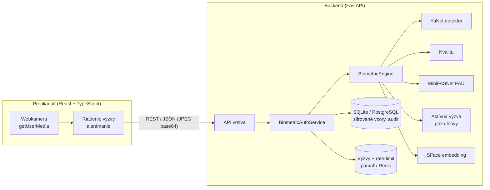

# FaceAuth – biometrická autentifikácia tváre s ochranou proti falšovaniu

Webová aplikácia na prihlásenie pomocou tváre (bez hesla) s viacvrstvovou detekciou
prezentačných útokov (*Presentation Attack Detection*, ISO/IEC 30107). Semestrálny projekt
z predmetu **Biometrické systémy bezpečnosti** (TUKE FEI).

| Vrstva | Technológia | Chráni proti |
|---|---|---|
| Kontrola kvality vzorky | YuNet detektor + Laplacián, jas, veľkosť | nekvalitným vzorkám, viacerým tváram |
| Pasívna detekcia živosti | ensemble 2× MiniFASNet (ONNX Runtime) | tlačenej fotografii, displeju, replay útoku |
| Aktívna detekcia živosti | náhodná jednorazová výzva pohybov hlavy | statickej fotografii, vopred nahranému videu |
| Konzistencia identity | porovnanie všetkých snímok relácie | výmene tváre počas snímania |
| Porovnanie vzorov | SFace (128-D vektor), kosínusová podobnosť | neoprávnenej osobe (impostor) |
| Ochrana vzorov | Fernet (AES-128-CBC + HMAC-SHA256) | úniku databázy |
| Ochrana API | jednorazové výzvy, rate-limit, lockout, JWT | replay, brute-force, enumerácii |

## Architektúra



Podrobný popis: [docs/architecture.md](docs/architecture.md) · REST API: [docs/api.md](docs/api.md) ·
Používateľská príručka: [docs/user-guide.md](docs/user-guide.md) · Testovanie a vyhodnotenie:
[docs/evaluation.md](docs/evaluation.md)

## Rýchly štart (lokálne, Windows / Linux / macOS)

Požiadavky: Python ≥ 3.11, Node.js ≥ 20, webkamera.

```bash
# 1) backend
cd backend
python -m venv .venv
.venv/Scripts/activate            # Linux/macOS: source .venv/bin/activate
pip install -e ".[dev,eval]"
python scripts/download_models.py # ~42 MB ONNX modelov do backend/models
uvicorn app.main:create_app --factory --reload --port 8000
```

```bash
# 2) frontend (v novom termináli)
cd frontend
npm ci
npm run dev                       # http://localhost:5173 (proxy /api -> :8000)
```

Databáza (SQLite `backend/data/app.db`) sa vytvorí migráciami automaticky pri štarte.
Swagger dokumentácia API: <http://localhost:8000/docs>.

Prvého administrátora nastavíte po registrácii:

```bash
cd backend
python -m app.cli promote <pouzivatel>
```

## Produkčné nasadenie (Docker)

```bash
cp .env.example .env
docker compose run --rm backend python -m app.cli generate-secrets   # vložte výstup do .env
# v .env nastavte FA_ENVIRONMENT=production a FA_SECURITY__EXPOSE_SCORES=false
docker compose up -d --build                                       # http://localhost:8080
```

Kompozícia spúšťa `frontend` (nginx – statické súbory + reverse proxy), `backend`
(uvicorn, 2 workery, migrácie pri štarte) a `redis` (zdieľané výzvy a rate-limit medzi
workermi). V produkcii musí byť pred aplikáciou HTTPS (prehliadač povolí kameru len
v zabezpečenom kontexte). Aplikácia v režime `production` odmietne naštartovať bez
nastavených tajomstiev.

## Nasadenie do cloudu (Vercel + Render)

* **Backend** – Render, Docker web služba + PostgreSQL podľa [render.yaml](render.yaml)
  (Dashboard → *New* → *Blueprint* → repozitár). Tajomstvá sa vygenerujú automaticky.
* **Frontend** – Vercel, *Root Directory* = `frontend`. [frontend/vercel.json](frontend/vercel.json)
  presmeruje `/api/*` na `https://faceauth-api.onrender.com` – prehliadač tak komunikuje
  iba s jednou doménou (bez CORS, prísna CSP). Ak Render pridelí inú adresu, upravte ju tam.

Bezplatná inštancia Render po 15 min nečinnosti uspí a prvá požiadavka trvá ~1 min;
bezplatná databáza Render expiruje po 30 dňoch.

## Testy a kvalita kódu

```bash
cd backend && pytest --cov=app && ruff check . && mypy app
cd frontend && npm run lint && npm test && npm run build
```

Backendové testy nahrádzajú neurónové siete deterministickými náhradami
(`tests/fakes.py`), takže celý tok – registrácia, overenie, útoky fotografiou, výmena
tváre, replay výzvy, lockout – sa testuje end-to-end cez HTTP bez GPU a bez modelov.

## Vyhodnotenie (grafy a tabuľky do správy)

```bash
cd backend
python -m evaluation.evaluate_recognition --lfw          # FAR/FRR/EER, ROC, DET na LFW
python -m evaluation.capture_dataset --out data/pad --label bona_fide
python -m evaluation.capture_dataset --out data/pad --label attack/print
python -m evaluation.capture_dataset --out data/pad --label attack/replay
python -m evaluation.evaluate_pad --dir data/pad         # APCER/BPCER/ACER (ISO/IEC 30107-3)
python -m evaluation.benchmark --image cesta/k/tvari.jpg # latencia jednotlivých fáz
python -m evaluation.audit_report                        # štatistika reálnych pokusov
```

Výsledky (JSON, CSV, Markdown tabuľky, PNG + PDF grafy pre LaTeX) sa ukladajú do
`backend/reports/<typ>-<čas>/`.

## Štruktúra projektu

```
backend/
  app/
    api/            HTTP vrstva (routy, závislosti, mapovanie odpovedí)
    biometrics/     detektor, embedding, kvalita, liveness (pasívna, aktívna, póza), engine
    core/           konfigurácia, bezpečnosť (JWT, šifrovanie), chyby, logovanie, rate-limit
    db/             ORM modely, session, migrácie
    repositories/   prístup k dátam
    schemas/        Pydantic modely API
    services/       prípady použitia (registrácia, overenie, identifikácia, výzvy)
  evaluation/       metriky ISO/IEC 19795-1 a 30107-3, skripty, grafy
  migrations/       Alembic
  scripts/          stiahnutie modelov
  tests/            pytest (jednotkové + end-to-end API)
frontend/
  src/
    api/            HTTP klient a typy
    auth/           relácia, ochrana rout
    biometrics/     riadenie výzvy, kontrola kvality, hlásenia
    camera/         webkamera, zachytávanie snímok
    components/     UI komponenty
    pages/          obrazovky
docs/               dokumentácia
```

## Použité modely a licencie

| Model | Zdroj | Licencia |
|---|---|---|
| YuNet (face_detection_yunet_2023mar) | OpenCV Zoo | MIT |
| SFace (face_recognition_sface_2021dec) | OpenCV Zoo | Apache-2.0 |
| MiniFASNetV2, MiniFASNetV1SE | Minivision Silent-Face-Anti-Spoofing, ONNX export yakhyo/face-anti-spoofing | Apache-2.0 |

Kód projektu je pod licenciou MIT.
