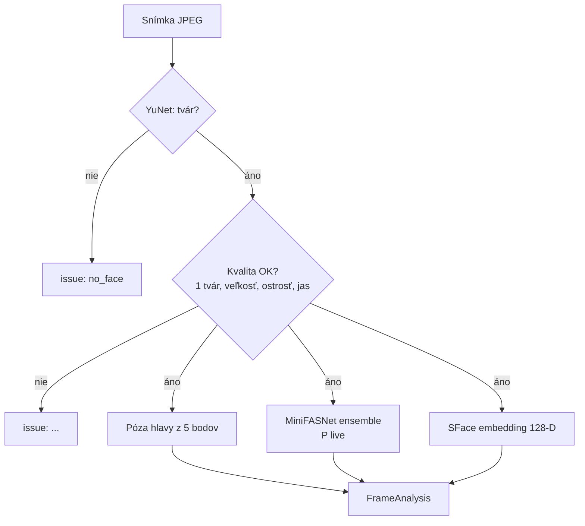
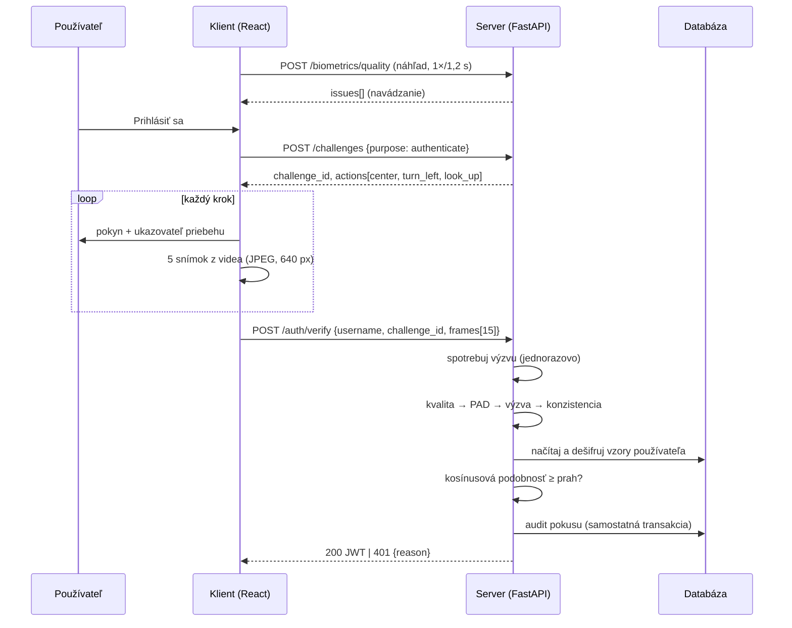
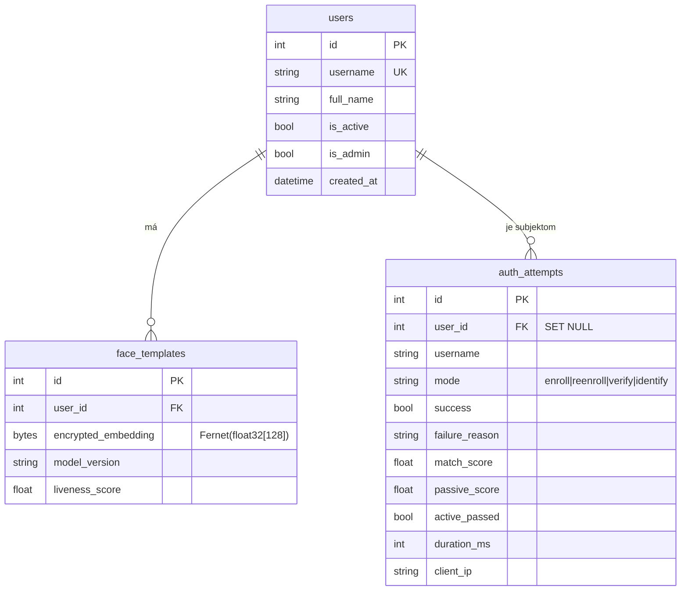

# Architektúra a návrh riešenia

## 1. Prehľad

Systém je rozdelený na **tenkého klienta** (React SPA) a **server** (FastAPI), ktorý robí
všetky biometrické rozhodnutia. Klient iba riadi snímanie a zobrazuje pokyny – nikdy
nerozhoduje o živosti ani zhode, pretože kód v prehliadači môže útočník ľubovoľne
upraviť. Server je bezstavový voči relácii (JWT), stav výziev a rate-limitov je
v pamäti alebo v Redise, trvalé dáta v relačnej databáze.

Backend je navrhnutý vrstvovo (clean architecture):

| Vrstva | Balík | Zodpovednosť |
|---|---|---|
| Prezentačná | `app/api` | HTTP, validácia vstupu (Pydantic), mapovanie chýb, autentifikácia JWT |
| Aplikačná | `app/services` | prípady použitia, transakcie, audit, lockout |
| Doménová | `app/biometrics` | detekcia, kvalita, živosť, embedding, rozhodovanie |
| Infraštruktúrna | `app/db`, `app/repositories`, `app/core` | databáza, šifrovanie, konfigurácia, Redis |

Komponenty sa skladajú v jedinom mieste (`app/container.py`, *composition root*).
Biometrické komponenty sú definované cez protokoly (`FaceDetector`, `FaceEmbedder`,
`PassiveLivenessDetector`), takže model možno vymeniť bez zásahu do zvyšku systému
a v testoch ich nahradiť deterministickými náhradami.

## 2. Biometrický reťazec



Pre celú reláciu (`BiometricEngine.evaluate_session`):

1. **Kvalita** – ak neexistuje použiteľná frontálna snímka, výsledok `quality`.
2. **Pasívna živosť** – priemer skóre živosti všetkých použiteľných snímok musí byť
   ≥ `passive_liveness.threshold` (0,70) a žiadna snímka nesmie klesnúť pod
   `min_frame_score` (0,30) → inak `passive_spoof`.
3. **Aktívna výzva** – každý krok musí obsahovať požadovaný pohyb hlavy → inak
   `active_challenge_failed`.
4. **Konzistencia identity** – minimálna podobnosť každej snímky so vzorom relácie
   ≥ 0,30 → inak `identity_inconsistent`.
5. Vzor relácie = normalizovaný priemer embeddingov frontálnych snímok.

Až potom sa vzor porovná s uloženým vzorom (1:1) alebo s galériou (1:N); prah zhody
je 0,40 (kosínusová podobnosť, odporúčanie autorov SFace je 0,363).

### 2.1 Pasívna detekcia (MiniFASNet)

Dva modely zo Silent-Face-Anti-Spoofing dostanú výrez tváre zväčšený 2,7× resp. 4×
(kontext okolia – rám displeja, okraj papiera), zmenšený na 80×80 px. Výstupom je
softmax nad 3 triedami (živá tvár = trieda 1). Výsledok je vážený priemer oboch modelov.
Modely bežia cez ONNX Runtime (CPU, voliteľne CUDA – `FA_MODELS__ONNX_PROVIDERS`).

### 2.2 Aktívna výzva (challenge–response)

Server vygeneruje výzvu kryptograficky bezpečným generátorom (`secrets.SystemRandom`):

```
center → 2 náhodné, navzájom rôzne akcie z {turn_left, turn_right, look_up, look_down}
```

(12 permutácií, nastaviteľné). Výzva má jednorazový identifikátor (192 bitov), platí
90 s a po prvom použití sa atomicky zmaže (`GETDEL` v Redise). Klient v každom kroku
zachytí 5 snímok po úvodnej pauze 700 ms.

Póza hlavy sa odhaduje geometricky z 5 bodov detektora YuNet (oči, nos, kútiky úst):

* landmarky sa otočia tak, aby spojnica očí bola vodorovná (kompenzácia náklonu – *roll*),
* `yaw = (x_nos − x_stred_očí) / vzdialenosť_očí` – kladné = otočenie doľava (z pohľadu osoby),
* `pitch = (y_nos − y_oči) / (y_ústa − y_oči)` – pohľad hore hodnotu znižuje, dole zvyšuje.

Krok `center` určí **osobnú neutrálnu pózu** (medián), ostatné kroky sa hodnotia ako
zmena voči nej. Krok je splnený, ak aspoň 2 snímky prekročia prah (yaw 0,20; pitch 0,07)
v správnom smere a aspoň 80 % snímok obsahuje použiteľnú tvár.

## 3. Sekvencia overenia



## 4. Dátový model



Fotografie sa **nikdy neukladajú**. Vzor je uložený šifrovane a viazaný na verziu
modelu (`model_version`) – po výmene modelu sa staré vzory nepoužijú.

## 5. Model hrozieb a protiopatrenia

| Útok | Protiopatrenie | Kde |
|---|---|---|
| Vytlačená fotografia | MiniFASNet (textúra, okraje), aktívna výzva | `liveness/passive.py`, `liveness/active.py` |
| Fotografia/video na displeji | MiniFASNet (moiré, rám), náhodné poradie pohybov | dtto |
| Vopred nahrané video s pohybmi | náhodná sekvencia + jednorazová výzva + krátka platnosť | `services/challenges.py` |
| Injekcia snímok mimo kamery (virtuálna kamera) | čiastočne: PAD na každej snímke, výzva; úplná ochrana vyžaduje atestáciu zariadenia | – |
| Výmena osoby počas relácie | konzistencia embeddingov všetkých snímok | `engine.py` |
| Opakované odoslanie zachytenej požiadavky | jednorazová výzva (GETDEL) | `services/challenges.py` |
| Brute-force / hill-climbing skóre | lockout po 5 neúspechoch / 15 min, rate-limit na IP, skrytie skóre v produkcii | `biometric_auth.py`, `deps.py` |
| Enumerácia používateľov | neexistujúci používateľ vracia rovnakú chybu `no_match` až po spracovaní relácie | `biometric_auth.py` |
| Únik databázy | šifrovanie vzorov (Fernet), kľúč mimo DB | `core/security.py` |
| Duplicitná registrácia jednej osoby | 1:N vyhľadanie pri registrácii | `biometric_auth.py` |
| DoS veľkými požiadavkami | limit veľkosti tela (20 MB), snímky (2 MB), počtu snímok (40), zmenšenie na 1280 px | `main.py`, `image.py` |
| XSS / clickjacking | CSP, X-Frame-Options, token v sessionStorage | `nginx.conf` |

## 6. Konfigurácia

Všetky prahy a limity sú v `app/core/config.py` a dajú sa meniť premennými prostredia
s prefixom `FA_` (vnorené skupiny oddelené `__`), napr. `FA_MATCHING__THRESHOLD=0.45`.
V režime `production` aplikácia overí, že sú nastavené tajomstvá a vypnuté detailné skóre.
